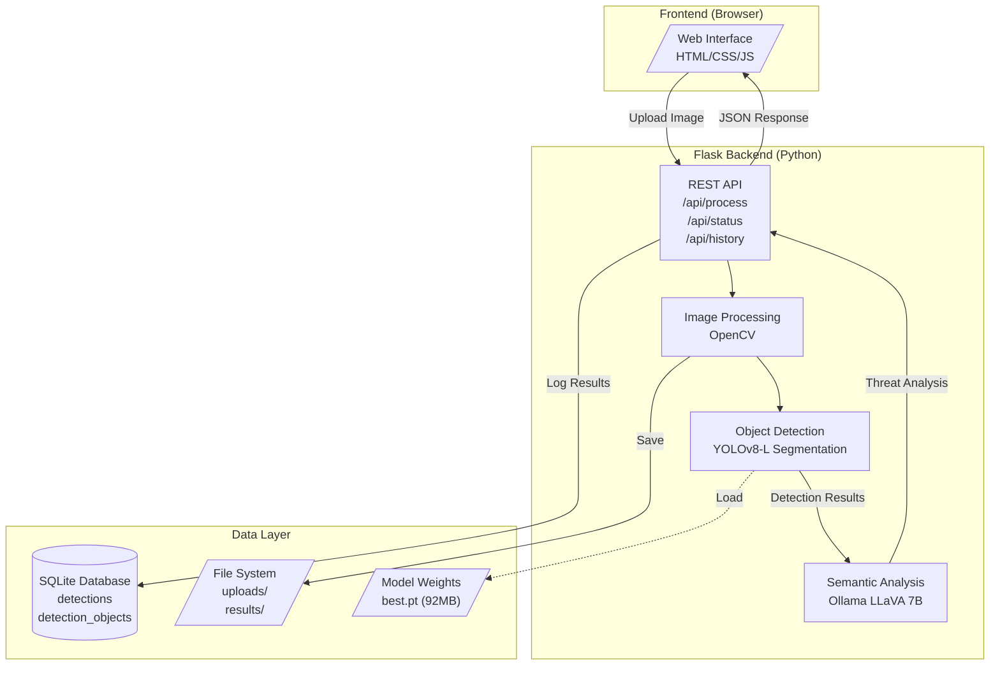
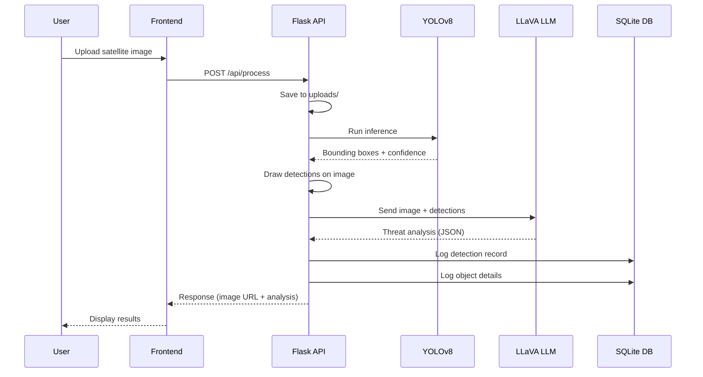
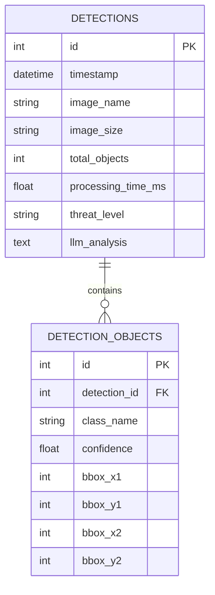

# System Architecture - Cantonment Area Detection System

## High-Level Architecture

## Data Flow

## Component Details

| Component | Technology | Purpose |
|-----------|------------|---------|
| **Frontend** | HTML5, CSS3, JavaScript | User interface for image upload and result display |
| **Backend** | Flask (Python 3.9+) | REST API, request handling, orchestration |
| **Object Detection** | Ultralytics YOLOv8-L | Detect military objects in satellite imagery |
| **Semantic Analysis** | Ollama + LLaVA 7B | AI-powered threat assessment and interpretation |
| **Database** | SQLite | Store detection logs, metrics, and analysis |
| **Image Processing** | OpenCV | Image I/O, bounding box rendering |

## Database Schema

